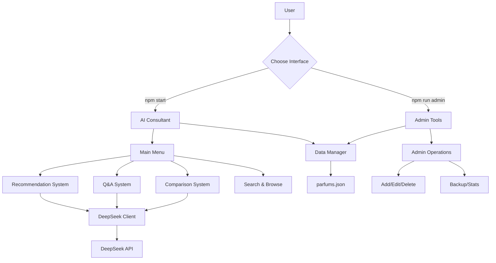

# AI Parfum Consultant MVP

Terminal-based AI Parfum Consultant yang menggunakan DeepSeek API untuk memberikan rekomendasi parfum personal, menjawab pertanyaan seputar fragrance, dan membandingkan produk parfum.

## Overview

Aplikasi ini adalah MVP (Minimum Viable Product) untuk konsultan parfum berbasis AI yang dirancang untuk:
- Membantu pengguna menemukan parfum yang sesuai dengan preferensi mereka
- Memberikan informasi mendalam tentang dunia parfum
- Membandingkan karakteristik berbagai parfum
- Mengelola database parfum secara efisien

## Table of Contents

- [Features](#-features)
- [Architecture](#-architecture--code-flow)
- [Installation](#-installation--setup)
- [Usage Guide](#-usage-guide)
- [Code Structure](#-code-structure--components)
- [Data Flow](#-data-flow)
- [API Integration](#-api-integration)
- [Database Schema](#-database-schema)
- [Admin Features](#-admin-features)
- [Troubleshooting](#-troubleshooting)
- [Contributing](#-contributing)

## Features

### **AI-Powered Recommendations**
- Analisis preferensi pengguna berdasarkan gender, occasion, season, dan budget
- Rekomendasi personal menggunakan DeepSeek AI
- Penjelasan detail mengapa parfum tertentu cocok

### **Q&A System**
- Tanya jawab interaktif tentang dunia parfum
- Informasi tentang fragrance notes, brands, dan tips penggunaan
- AI context-aware dengan database parfum internal

### **Parfum Comparison**
- Perbandingan side-by-side antara dua parfum
- Analisis notes, longevity, sillage, dan occasion
- Rekomendasi untuk target pengguna yang berbeda

### **Smart Search & Browse**
- Pencarian berdasarkan nama, brand, atau kategori
- Filter berdasarkan gender, price range, season
- Display tabel yang informatif dan mudah dibaca

### **Database Management**
- CRUD operations lengkap untuk data parfum
- Backup dan restore database
- Statistik dan analytics database

## Architecture & Code Flow



### **Application Flow**

1. **Initialization**
   - Load environment variables (.env)
   - Initialize DeepSeek API client
   - Load parfum database (JSON)

2. **User Interface Selection**
   - **Consumer App**: Interactive recommendations and queries
   - **Admin App**: Database management and maintenance

3. **AI Processing Pipeline**
   - User input → Data preparation → API call → Response processing → Display

4. **Data Management**
   - JSON-based storage for simplicity
   - In-memory caching for performance
   - Backup system for data protection

## Installation & Setup

### Prerequisites
```bash
# Required software
Node.js >= 16.0.0
npm >= 8.0.0

# Required accounts
DeepSeek API account (https://platform.deepseek.com)
```

### Step-by-Step Installation

1. **Clone Repository**
```bash
git clone <repository-url>
cd parfum-ai-mvp
```

2. **Install Dependencies**
```bash
npm install
```

3. **Environment Setup**
```bash
# Copy environment template
cp .env.example .env

# Edit with your API key
nano .env
```

4. **Environment Variables**
```env
# Required
DEEPSEEK_API_KEY=sk-your-api-key-here

# Optional (dengan default values)
DEEPSEEK_API_URL=https://api.deepseek.com/chat/completions
APP_NAME=AI Parfum Consultant
VERSION=1.0.0
DEBUG=false
```

5. **Verify Installation**
```bash
# Test consumer app
npm start

# Test admin app  
npm run admin
```

## 📖 Usage Guide

### 🎯 **Getting Recommendations**

1. **Launch Application**
```bash
npm start
```

2. **Follow Interactive Prompts**
   - Gender selection (Men/Women/Unisex)
   - Occasion preferences (Casual/Office/Formal/etc.)
   - Season preferences (Spring/Summer/Fall/Winter)
   - Budget range (Low/Medium/High)
   - Additional preferences (free text)

3. **Receive AI Analysis**
   - Personalized recommendations
   - Detailed explanations
   - Alternative suggestions

### **Q&A System**

**Example Questions:**
```
"Apa perbedaan antara EDT dan EDP?"
"Parfum apa yang cocok untuk cuaca tropis?"
"Bagaimana cara memakai parfum yang benar?"
"Apa yang dimaksud dengan top notes, middle notes, dan base notes?"
```

### ⚖️ **Comparing Parfums**

1. Select two parfums from available database
2. AI will analyze and compare:
   - Fragrance notes breakdown
   - Performance (longevity & sillage)
   - Suitable occasions and seasons
   - Target demographics
   - Value proposition

## 🗂️ Code Structure & Components

### 📁 **Directory Structure**
```
parfum-ai-mvp/
├── src/                    # Source code
│   ├── ai-consultant.js    # Main consumer interface
│   ├── admin-tools.js      # Admin management interface  
│   ├── deepseek-client.js  # AI API client
│   └── data-manager.js     # Database operations
├── data/                   # Data storage
│   └── parfums.json        # Parfum database
├── config/                 # Configuration files
├── .env.example           # Environment template
├── .env                   # Environment variables (gitignored)
├── package.json           # Dependencies & scripts
├── README.md              # Documentation
└── CLAUDE.md              # Development guide
```

### 🔧 **Core Components**

#### **1. DeepSeek Client (`deepseek-client.js`)**
```javascript
class DeepSeekClient {
  // AI API communication
  async sendMessage(messages, options)
  
  // Specialized methods
  async getParfumRecommendation(preferences, data)
  async answerParfumQuestion(question, data)  
  async compareParfums(parfum1, parfum2, data)
}
```

**Key Features:**
- Axios-based HTTP client dengan error handling
- Payload optimization untuk menghindari API limits
- Temperature dan token control untuk response quality
- Retry logic untuk network stability

#### **2. Data Manager (`data-manager.js`)**
```javascript
class DataManager {
  // Core CRUD operations
  async loadParfumData()
  async saveParfumData(data)
  async addParfum(parfumData)
  async updateParfum(id, parfumData)
  async deleteParfum(id)
  
  // Search & filter operations
  async searchParfums(query)
  async getParfumsByBrand(brand)
  async getParfumsByCategory(category)
  async getParfumsByGender(gender)
}
```

**Key Features:**
- File-based JSON storage
- Search algorithms dengan multiple criteria
- Data validation dan error handling
- Backup dan restore capabilities

#### **3. AI Consultant (`ai-consultant.js`)**
```javascript
class AIParfumConsultant {
  // User interface methods
  async showMainMenu()
  async getRecommendation()
  async askQuestion()
  async compareParfums()
  async searchParfums()
  
  // Utility methods
  async listAllParfums()
  async showStats()
}
```

**Key Features:**
- Inquirer.js untuk interactive prompts
- Chalk untuk colored output
- Ora untuk loading indicators
- CLI-Table3 untuk formatted displays

#### **4. Admin Tools (`admin-tools.js`)**
```javascript
class AdminTools {
  // Database management
  async addParfum()
  async editParfum()
  async deleteParfum()
  
  // Utility operations
  async backupDatabase()
  async showStats()
  async searchParfums()
}
```

## 🔄 Data Flow

### **1. Recommendation Flow**
```
User Input → Preference Analysis → Data Filtering → AI Processing → Response Generation → Display
```

**Detailed Steps:**
1. User mengisi form preferensi
2. Data preferences di-compile menjadi structured text
3. Relevant parfums di-filter dari database
4. Data dikirim ke DeepSeek API dengan system prompt
5. AI response di-parse dan di-format
6. Results ditampilkan dengan styling

### **2. Comparison Flow**
```
Parfum Selection → Data Extraction → Payload Optimization → AI Analysis → Formatted Output
```

**Detailed Steps:**
1. User memilih 2 parfums dari list
2. System extract data parfums dari database
3. Data di-optimize untuk menghindari payload limits
4. Structured comparison prompt dikirim ke AI
5. AI response di-format dalam comparison table
6. Results ditampilkan dengan highlights

### **3. Q&A Flow**
```
Question Input → Context Preparation → AI Query → Response Processing → Answer Display
```

**Detailed Steps:**
1. User input free-form question
2. System prepare context dengan parfum database summary
3. Question + context dikirim ke AI
4. AI response divalidasi dan di-clean
5. Answer ditampilkan dengan formatting

## 🔌 API Integration

### **DeepSeek API Configuration**

```javascript
// API client setup
const client = axios.create({
  baseURL: 'https://api.deepseek.com',
  headers: {
    'Authorization': `Bearer ${API_KEY}`,
    'Content-Type': 'application/json'
  },
  timeout: 30000
});
```

### **Request Optimization**

**Payload Size Management:**
- Maximum payload size: ~4000 characters
- JSON simplification untuk large datasets
- Text-based prompts instead of nested JSON
- Selective data inclusion berdasarkan context

**Error Handling:**
```javascript
try {
  const response = await api.post('/chat/completions', payload);
  return response.data.choices[0].message.content;
} catch (error) {
  if (error.response) {
    // HTTP error dari server
  } else if (error.request) {
    // Network connection error
  } else {
    // Request setup error
  }
}
```

### **Response Processing**

**Token Management:**
- Recommendation: 1500 tokens max
- Comparison: 2000 tokens max  
- Q&A: 1200 tokens max
- Temperature: 0.7 untuk balance creativity/accuracy

## 📊 Database Schema

### **Parfum Object Structure**

```json
{
  "id": "string",
  "name": "string",
  "brand": "string", 
  "category": "string",
  "gender": "Men|Women|Unisex",
  "notes": {
    "top": ["string"],
    "middle": ["string"], 
    "base": ["string"]
  },
  "description": "string",
  "price_range": "low|medium|medium-high|high|luxury",
  "longevity": "string (e.g., '6-8 hours')",
  "sillage": "light|moderate|moderate-heavy|heavy",
  "season": "spring|summer|fall|winter|all",
  "occasion": "casual|office|formal|night|party|romantic",
  "year_released": "number"
}
```

### **Database Operations**

**Search Algorithm:**
```javascript
// Multi-field search dengan case-insensitive matching
const results = parfums.filter(parfum => 
  parfum.name.toLowerCase().includes(query.toLowerCase()) ||
  parfum.brand.toLowerCase().includes(query.toLowerCase()) ||
  parfum.category.toLowerCase().includes(query.toLowerCase()) ||
  parfum.description.toLowerCase().includes(query.toLowerCase())
);
```

**Data Validation:**
- Required fields validation
- Enum value validation untuk categorical fields
- Year range validation (1800 - current year)
- Notes array validation (minimal 1 item per category)

## ⚙️ Admin Features

### **Database Management**

1. **Add New Parfum**
   - Guided form dengan validation
   - Auto-generate unique ID
   - Duplicate name checking

2. **Edit Existing Parfum**
   - Search dan select parfum
   - Pre-filled form dengan current values
   - Partial updates supported

3. **Delete Parfum**
   - Confirmation dialog
   - Soft delete dengan backup
   - Undo capability

### **Data Operations**

1. **Backup System**
   - Timestamped backup files
   - JSON format preservation
   - Automatic backup before major operations

2. **Statistics Dashboard**
   - Total parfums count
   - Brand distribution
   - Category breakdown
   - Gender distribution
   - Price range analysis

3. **Import/Export** (Future feature)
   - CSV import capability
   - Bulk operations
   - Data validation during import

## 🔧 Troubleshooting

### **Common Issues**

1. **API Connection Errors**
```bash
Error: Tidak dapat terhubung ke DeepSeek API
```
**Solutions:**
- Check internet connection
- Verify API key dalam .env file
- Check API quota/limits
- Try again after few minutes

2. **Environment Variable Issues**
```bash
Error: DEEPSEEK_API_KEY tidak ditemukan
```
**Solutions:**
- Ensure .env file exists
- Check .env file formatting
- Restart application after .env changes

3. **Payload Too Large Errors**
```bash
Error: Request entity too large
```
**Solutions:**
- Database terlalu besar untuk single request
- Consider data pagination
- Reduce database size temporarily

### **Debug Mode**

Enable debug logging:
```env
DEBUG=true
```

## 🧪 Testing

### **Manual Testing Checklist**

- [ ] Environment setup works
- [ ] Database loads correctly
- [ ] All menu options functional
- [ ] API calls successful
- [ ] Error handling works
- [ ] Admin tools operational
- [ ] Data persistence works

### **Performance Considerations**

- JSON file loading: < 100ms for typical dataset
- API response time: 2-5 seconds average
- Memory usage: < 50MB for typical operation
- Concurrent user limit: Single user (CLI app)

## 🎯 Future Roadmap

### **Phase 2 Features**
- [ ] Web interface version
- [ ] Multiple AI provider support
- [ ] Advanced recommendation algorithms
- [ ] User preference learning
- [ ] Social features (reviews, ratings)

### **Phase 3 Features**
- [ ] Mobile app
- [ ] E-commerce integration
- [ ] Inventory management
- [ ] Multi-language support
- [ ] Voice interface

### **Technical Improvements**
- [ ] Database migration to PostgreSQL/MongoDB
- [ ] Caching layer implementation  
- [ ] API rate limiting
- [ ] Unit test coverage
- [ ] Docker containerization
- [ ] CI/CD pipeline

## 🤝 Contributing

### **Development Setup**
1. Fork repository
2. Create feature branch
3. Follow coding standards
4. Add tests for new features
5. Submit pull request

### **Coding Standards**
- ESLint configuration provided
- Async/await preferred over promises
- Error handling required for all API calls
- JSDoc comments for public methods

### **Pull Request Process**
1. Update documentation
2. Add/update tests
3. Ensure backward compatibility
4. Update CHANGELOG.md

## 📄 License

This project is licensed under the MIT License - see the LICENSE file for details.

## 🙏 Acknowledgments

- **DeepSeek AI** untuk powerful AI capabilities
- **Node.js community** untuk excellent libraries
- **Parfum enthusiasts** untuk domain expertise
- **Open source contributors** untuk continuous improvements

---

**Made with ❤️ for Indonesian parfum enthusiasts and developers**

*Dokumentasi ini akan terus diupdate seiring development aplikasi. Untuk pertanyaan teknis, silakan buka issue di repository.*